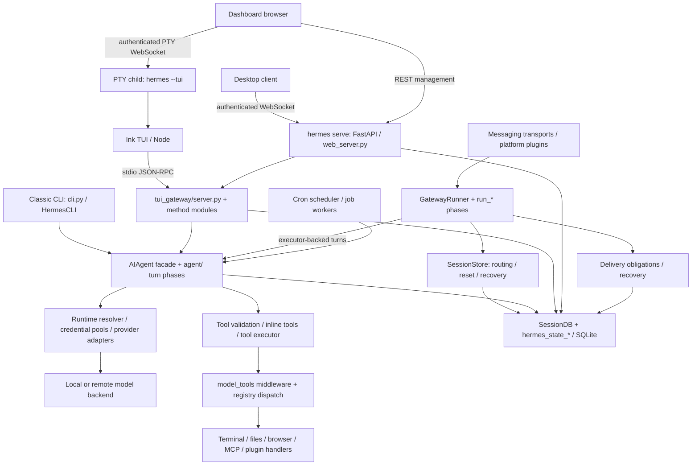

# Hermes runtime architecture audit

Date: 2026-09-19. Source revision: `df466b967d5c1717aa37b5659cb43a212ca985eb`.

Scope: the analysis-only task in [sprint-1.4-runtime-audit.md](../../.ai/prompts/sprint-1.4-runtime-audit.md). This report documents the checked-out implementation, not a proposed replacement architecture. No source, tests, APIs, dependencies, or file locations were changed.

Method: read repository instructions and security policy; trace entry points, topical modules, ownership and dispatch paths; count physical Python source lines without importing the application. This is a static audit, not a security certification or a measured runtime benchmark. No services, provider calls, database migrations, tests, or eval harnesses were executed. Findings below distinguish observed mechanisms from inferred risks. Repository documentation is supporting context; source takes precedence where they disagree.

## 1. Current architecture diagram

Arrows show control/data dependencies, not one common process tree. In particular:

- A standalone messaging gateway has its own lifetime. `hermes serve` is the desktop control backend; `dashboard` shares the server implementation but supplies the browser SPA. Neither is a synonym for `gateway run`.
- Ink owns rendering; its Python backend owns model execution, session mutation, tool dispatch and slash-command behavior. Dashboard primary chat embeds the real TUI through a PTY rather than implementing another agent loop.
- The WebSocket server and stdio transport expose the same Python RPC implementation. Remote desktop connections do not imply the backend was spawned locally by Electron.
- Cron jobs create agent work outside the messaging runner's active-agent map. Desktop-spawned backends also have a conditional cron ticker.
- SQLite is shared by processes within a profile. Python objects, callbacks, thread pools and tool caches are not shared across those processes.

Evidence: [gateway/run.py](../../gateway/run.py), [gateway/run_startup.py](../../gateway/run_startup.py), [hermes_cli/web_server.py](../../hermes_cli/web_server.py), [web/AGENTS.md](../../web/AGENTS.md), [tui_gateway/AGENTS.md](../../tui_gateway/AGENTS.md), [tui_gateway/server.py](../../tui_gateway/server.py).

## 2. Runtime flow

### 2.1 Startup and process ownership

**CLI and profiles.** `hermes_cli/main.py` applies the profile override before imports that resolve profile paths. The classic `HermesCLI` loads configuration, restores or starts a conversation and calls the shared agent. Configuration is not read through one uniform entry point: `cli.py::load_cli_config`, `hermes_cli/config.py::load_config`, and gateway raw YAML loading have distinct behavior. Defaults and precedence must be checked at the actual consumer.

**Messaging gateway.** `gateway/run.py::start_gateway` coordinates instance replacement, the runtime lock/PID record, runner startup, control socket, scheduler/housekeeping threads and shutdown tail. `GatewayRunner` composes lifecycle, inbound, turn, cache, authorization and notification mixins.

`GatewayStartupMixin.start` performs environment/access-policy checks and previous-run recovery, then closes an inbound restore gate. It warms turn machinery concurrently with platform connections, handles primary and multiplexed-profile adapters, records running status, finishes wiring and starts background watchers. Connection errors are classified: some retryable failures leave the gateway alive for recovery and cron instead of forcing a restart loop.

Restoration is coordinated with live input. `_run_startup_resume_event` waits for the restored turn; `_finish_startup_restore` bounds the wait and drains queued inbound events. A timeout releases the startup gate without cancelling still-running restore work. Session slots are preclaimed so newly arriving input queues behind restoration. Boot notification/redelivery sends have separate bounded waits; `_await_startup_boot_sends` claims delivery obligations and clears resume flags before sending, avoiding independent replay and redelivery of the same owed response.

**Serve/dashboard.** `hermes_cli/web_server.py::start_server` configures authentication and starts Uvicorn with a split socket-bind/readiness sequence. Its lifespan starts schema reconciliation, hosted-room recovery, PTY reaping, self-tests, auto-archive and optional managed local inference. Desktop mode starts a cron ticker. Reconciliation/local-model startup are background work: a listening socket is not proof that every subsystem is healthy.

**Detached actions.** `hermes_cli/web_server_gateway.py::_spawn_hermes_action` records subprocess handles and uses platform-specific detachment. The lifecycle rule says messaging gateways survive the desktop. However, server shutdown also calls `_terminate_desktop_managed_gateway`, which terminates a still-live `gateway-restart` action handle. That exception must remain visible in any process-ownership redesign; detachment alone does not prevent an explicit `terminate()`.

### 2.2 Inbound messages and turns

1. A platform adapter produces a `MessageEvent` and `SessionSource`; profile and channel/thread identity determine routing.
2. Authorization is evaluated against the applicable caller policy. `gateway/authz_mixin.py` handles scoped settings, allowlists and adapter policy verdicts; it does not treat a session ID as a credential.
3. Two busy guards coordinate input: the base adapter queues messages for active sessions; runner logic handles controls such as stop, new-session and approval commands. A control command needed during approval must pass both guards.
4. Session routing resolves the active durable session. Runner state tracks the current generation and turn lease; cached agent/config state and persisted model overrides feed agent construction or reuse.
5. The synchronous `AIAgent` conversation loop executes on the surface's worker path. Turn phases assemble requests, call providers, process tool calls, handle retries/compression and finalize the response. `agent/turn_facade_lease.py` supplies the session turn-lease boundary.
6. Messages and tool progress are persisted incrementally, then projected to UI/transport output. Gateway delivery state is separate from inference completion: a generated response can still be owed to a transport.

Sources: [gateway/run_inbound.py](../../gateway/run_inbound.py), [gateway/run_busy.py](../../gateway/run_busy.py), [gateway/run_turn.py](../../gateway/run_turn.py), [gateway/run_agent_cache.py](../../gateway/run_agent_cache.py), [agent/conversation_loop.py](../../agent/conversation_loop.py), [agent/tool_executor.py](../../agent/tool_executor.py).

### 2.3 Shutdown and background workers

`gateway/run_shutdown.py::stop` coalesces callers around a retained stop task. `_stop_impl` sequences:

1. Begin teardown and stop lifecycle watchers.
2. Mark resumable work and drain messaging agents, cron jobs, API-server work and deferred executor workers. Cron has a separately calculated drain budget.
3. If work exceeds its deadline, request interrupts, settle workers, kill tool subprocesses and notify interrupted cron jobs while transport is still available.
4. Finalize agents and disconnect adapters.
5. Cancel/release runtime state and clean tool/browser environments while preserving the orchestration tasks needed to finish shutdown.
6. Quiesce session persistence, close/release stores and persist exit status; release runtime ownership.

A thread-based watchdog bounds shutdown. Cancelling an asyncio waiter does not establish that its synchronous executor worker stopped; `_deferred_agent_workers` explicitly tracks work that outlived its coroutine.

Background ownership includes gateway cron/housekeeping threads, adapter tasks, restore tasks, process-completion watchers, agent/tool executors, MCP/browser subprocesses, SessionDB writer machinery, and surface-specific PTY/reaper/hosted-room tasks. Each needs an owner and a drain/interrupt/release path; the runner's messaging map alone is incomplete.

Serve/dashboard lifespan cancels periodic tasks, closes PTYs, stops hosted-room work and the managed local runtime, and signals its cron ticker. TUI `server.py::_shutdown_sessions` is registered at exit; session teardown distinguishes shared launch DB handles from owned handles. WebSocket disconnect/reaping is not equivalent to an immediate durable session deletion.

### 2.4 Session lifecycle and mutation points

| Stage | Owner and behavior |
|---|---|
| Identity | `gateway/session.py`: `SessionSource`, `SessionEntry`, `build_session_key`; routing keys incorporate platform/chat/thread/profile context. Runtime task IDs and durable session IDs serve different purposes. |
| Creation/reset | `gateway/session_lifecycle.py` applies route/reset/expiry rules. TUI `methods_session.py` registers `session.create` and creates runtime IDs and agent context; active-session slots are claimed when execution needs them rather than for an unused draft. |
| Storage | `SessionDB` stores session metadata, messages, usage and model configuration. `SessionStore` maintains the messaging routing index. `state.db` is primary; `sessions.json` is a legacy routing mirror, not the universal session list. JSONL fallback/diversion paths still exist. |
| Restoration | Gateway startup recovery handles active-turn/resume markers and owed deliveries. TUI `session.resume` locates the row, follows the compression tip, applies guards and selects live reuse, lazy/deferred or cold/eager restoration. Restoring a transcript is not restoration of an old Python thread. |
| Per-turn mutation | Active turn markers, generation/lease state, messages, usage and tool progress change. Gateway `skip_db` transcript writes avoid duplicating messages already flushed by the agent. |
| Conversation boundary | New/reset/resume transitions clear conversation overrides and security prompts through explicit funnels; generation counters must remain monotonic so stale unwinds cannot release a newer turn's lease. |
| Compression | Active history and compression metadata change; code supports compression-tip rerouting and session lineage. Do not assume every compression keeps the same ID or every compression rotates it. |
| Close/delete | Runtime teardown, ending a durable row, releasing a lease, archiving and deleting are distinct operations. TUI checks other runtime ownership before ending shared session state. |

Evidence: [gateway/session_persistence.py](../../gateway/session_persistence.py), [gateway/session_transcript.py](../../gateway/session_transcript.py), [gateway/session_recovery.py](../../gateway/session_recovery.py), [tui_gateway/methods_session.py](../../tui_gateway/methods_session.py), [tui_gateway/session_lifecycle.py](../../tui_gateway/session_lifecycle.py).

### 2.5 Tool execution pipeline

1. **Discovery and registration:** `tools/registry.py::discover_builtin_tools` discovers built-ins; tool modules register handlers and schemas at import. Plugins add scoped registrations through the plugin infrastructure. `toolsets.py` defines exposure bundles.
2. **Schema selection:** `model_tools.py::get_tool_definitions` combines enabled/disabled toolsets with availability checks and schema post-processing. `check_fn` availability is cached; it is not a per-session authorization boundary. TUI `_load_enabled_toolsets(platform)` derives surface toolsets from session platform.
3. **Validation:** `agent/turn_tool_validation.py::validate_tool_calls` checks names against `agent.valid_tool_names`, normalizes call identity and handles malformed/mixed-validity calls. The executor parses argument objects and applies deferred-tool bridge scope checks.
4. **Scheduling:** `agent/tool_executor.py` supports sequential, concurrent and segmented execution. Parallel workers propagate session/profile/approval context; authorization and start-order gates prevent competing prompts and late dispatch after batch abandonment.
5. **Execution:** inline agent tools use `INLINE_TOOL_EXECUTORS`; other calls reach `model_tools.py::handle_function_call`. Tool-search calls are unwrapped to the real tool identity before downstream hooks. Request middleware, pre-tool hooks, ACP edit approval, execution middleware and registry dispatch form the normal path. Registry handlers normalize results to JSON strings.
6. **Tool-specific checks:** terminal approval guards and file-write guards operate in their respective implementations. Callback context identifies the requesting session. A registry dispatch is not proof that every tool uses one identical permission mechanism.
7. **Result commit:** the executor observes outcomes, commits progress and projects messages/UI events. Result budgets, persisted oversized results, post-tool hooks and tool-call/result pairing are part of this contract, including errors and interruptions.

Important distinction: tool visibility and approval checks reduce mistakes; they do not isolate hostile code inside the interpreter. The actual isolation boundary is described below.

### 2.6 Provider routing and fallback

Model choice enters through config, explicit command/runtime options, persisted per-session overrides and model-switch logic. Provider, model, endpoint, credential and API mode must be resolved together; a model string alone is insufficient to reconstruct a route.

`hermes_cli/runtime_provider.py::resolve_runtime_provider` is an ordered ladder: disabled-provider check; requested-provider shortcuts; named custom/local aliases; local-endpoint bypass; auth resolution and explicit endpoint/credential handling; credential pools; OAuth/external-process/native provider paths; registry API-key providers; final OpenRouter/bare-custom resolution. `_ladder_rungs` is lazy: a successful earlier candidate prevents later candidates from running. Preserve that order during extraction.

The abstraction is distributed across runtime resolution, provider profiles/registries, client lifecycle, request projection and native adapters. `agent/provider_base.py` supplies common identity/picker ABCs for pluggable backends; it is not a single universal inference interface replacing those layers.

Main-agent error/recovery phases can invoke `agent/chat_completion_helpers.py::try_activate_fallback`. Current code advances `_fallback_index` through `_fallback_chain`, skips unavailable entries and constructs the replacement via `resolve_provider_client`. Activation updates client, model, provider, API mode, context/reasoning settings and route provenance before retrying. Credential rotation within a provider and switching to another provider are separate recovery operations.

Auxiliary calls use `agent/auxiliary_client.py`, with task-specific overrides. `_resolve_auto_route` first tries the main provider/model, then the task fallback chain, then the main configured fallback chain, followed by discovery. Auxiliary retry/client-cache logic is substantial and must not be replaced with the main resolver by assumption.

Source/documentation discrepancy: the developer provider guide describes a one-shot `_fallback_activated` guard, but the current implementation advances a chain. Its claim that auxiliary routing is independent also needs qualification because auxiliary auto-routing now consumes main route/fallback policy. This report follows code; live routing parity has not been tested.

## 3. Module responsibilities

### 3.1 Responsibility map

| Module family | Current responsibility | Coupling to preserve |
|---|---|---|
| `hermes_cli/main.py`, `cli.py`, CLI mixins | Bootstrap, profile selection, classic REPL and slash dispatch | Profile selection before path-sensitive imports; config-loader precedence; shared command registry |
| `gateway/run.py`, `run_*` | Messaging composition, startup/drain/restart, inbound turns, cached agents, workers and delivery | Shared runner fields, late facade imports, two message guards, stream-final contract |
| `gateway/session*` | Routing identity, reset/expiry, recovery and transcript handoff | Routing-store ownership differs from transcript profile ownership |
| `hermes_cli/web_server.py`, `web_server_*`, `web_routers/*` | FastAPI bootstrap, auth, management endpoints, WebSocket/PTy integration, backend workers | Auth middleware ordering, ready-vs-healthy distinction, detached action ownership |
| `tui_gateway/server.py`, `methods_*`, lifecycle helpers | RPC registration, live sessions, callbacks, worker pool, resume/close and event projection | Split functions are rebound to server globals by `method_ctx.py` |
| `run_agent.py`, `agent/agent_init.py`, `agent/turn_*` | Agent construction, conversation execution, context, retries, tools and finalization | Prompt bytes, message ordering, turn lease and incremental persistence |
| `model_tools.py`, `tools/registry.py`, `toolsets.py` | Discovery, tool exposure, middleware and handler dispatch | Session grants versus process-level registry/cache; inline tools are a separate path |
| `hermes_cli/runtime_provider*`, `agent/auxiliary_client.py`, client/adapters | Provider selection, credentials, transport modes and recovery | Explicit endpoint precedence, profile credentials, fallback provenance |
| `hermes_state.py`, `hermes_state_*` | Session persistence, schema, messages, usage, FTS, compression and recovery | Shared-handle ownership, file generation, WAL safety, writer/read-pool lifecycle |
| `evals/*` | Specialized structural, resource and model-behavior evaluations | Different harnesses have different isolation, cost and validity assumptions |

There is no root `web_server.py` implementation in this trace: the task's server/router names refer to `hermes_cli/web_server.py` and `hermes_cli/web_routers/`.

### 3.2 State ownership

| State | Authoritative owner / lifetime | Consequence |
|---|---|---|
| Profile home/config/secrets | Profile-resolved paths and scoped runtime context | Profiles are independent; multiplexed misses must not fall back to another profile's environment. |
| Gateway live session state | `gateway/session_state.py::SessionState` | `TurnState`, `ConversationState`, `PersistentState` have distinct reset rules. The word persistent does not guarantee every field is durable. |
| Routing index | `SessionStore._routing_db`, fixed to its routing home | A multiplex gateway has one flat routing map; do not rewrite it into whichever profile happens to be active. |
| Transcript / session rows | Per-session/profile SessionDB | `_db` follows active scope; transcript operations resolve the owning session store. |
| SQLite connection generations | `hermes_state_registry.py` | One shared writer object per resolved path per process, refcounted; replaced generations retire until owners release them. Shared `close()` is not ownership release. |
| SQLite file identity/WAL safety | `hermes_state_dbfile.py`, guard/repair/holder siblings | Header probes and sidecar checks must not undermine live SQLite locks. POSIX cached probe FDs are deliberately retained. |
| Live TUI sessions and RPC methods | `tui_gateway/server.py` globals/locks | Moving a function to another file did not transfer the state it reads or mutates. |
| Prompt/messages/usage/client | Current AIAgent plus persisted replay data | Resume must preserve wire-relevant content and account for provider-specific state. |
| Tool catalog/availability | Registry plus scoped registrations and cached checks | Process-wide caches cannot answer which client surface owns a session. |
| Delivery obligations | Gateway delivery ledger in SQLite | Completion of inference and acknowledgment of delivery are different transitions. |

`hermes_state_common.py` contains schema/constants (current `SCHEMA_VERSION = 30`). `hermes_state.py` composes persistence mixins and connection/write lifecycle; `hermes_state_dbfile.py` owns file-level health and generation probes. These are not interchangeable persistence facades. The session-storage guide still labels the current schema as 23 while listing later migrations, so it is not a reliable version source.

### 3.3 AGENTS.md constraints

The root and area instructions are architectural constraints, not evidence that every path already satisfies them:

- Preserve a conversation's cached prefix and byte-stable system prompt; compression is the stated exception. Commands affecting skills/tools/memory default to deferred invalidation, with explicit `--now` behavior.
- Preserve message alternation and tool-result pairing. Do not inject synthetic user messages mid-loop; cron deliveries use separate sessions.
- Keep capability at existing edges: extend existing code, CLI/skill, service-gated tool, plugin or MCP before adding a core schema.
- Use session platform for surface capabilities; reserve availability checks for reachability/opt-in.
- Use profile-aware path helpers. Keep behavioral settings in YAML and secrets in credential storage. Preserve fail-closed multiplex secret/allowlist reads.
- Find definitions in topic modules. Avoid new god files and long name-based branch ladders. Internal moves require consumer and documentation updates, not new internal re-export shims.
- Do not use external `PLUGIN-COMPAT` pointers from in-tree code. Such blocks are still present at this revision despite the historical removal date in the instructions; their existence is not authorization to use them.
- Future tests must use `scripts/run_tests.sh`, real imports and temporary `HERMES_HOME` for resolution/I/O/security boundaries. Use behavioral invariants, host-native OS markers, and no source-text assertion tests.
- Dashboard primary chat remains the embedded TUI. Gateway controls needed during a blocked turn must bypass both busy guards; streaming adapters retain cumulative-prefix and final-delivery contracts.

Sources: [root AGENTS.md](../../AGENTS.md), [gateway rules](../../gateway/AGENTS.md), [CLI rules](../../hermes_cli/AGENTS.md), [agent rules](../../agent/AGENTS.md), [tool rules](../../tools/AGENTS.md), [TUI rules](../../tui_gateway/AGENTS.md), [web rules](../../web/AGENTS.md).

### 3.4 SECURITY.md boundaries

[SECURITY.md](../../SECURITY.md) defines a single-tenant personal agent. Within an adapter's authorized caller set, callers are equally trusted; session IDs are routing handles, not tenant capabilities.

| Boundary/control | Policy and implementation implications |
|---|---|
| External callers → execution/output/approval | Network surfaces require configured authorization; local IPC relies on host-user access control unless an explicit network auth layer is added. Authorization must cover output and approval resolution as well as prompt submission. |
| Messaging authorization | `authz_mixin.py` and adapter policies resolve the caller set. Multiplex scoping is part of this boundary. No complete adapter-by-adapter authorization proof was performed here. |
| HTTP / WebSocket access | `web_server.py` implements session-token checks, route exceptions, host checks, OAuth cookie gating and an opt-in token-auth seam. Middleware order and WS authentication must be reviewed together; the simple statement “all routes use a token” is incomplete for current code. |
| LLM → shell/files | A nonlocal terminal backend confines shell and shell-backed file operations to the backend's exposed resources. Local execution has the operator's host access. |
| Python process → host | Terminal-backend isolation does not contain plugin code, MCP children or the host code-execution child. Whole-process wrapping is the supported boundary for untrusted input/shared production use. |
| Credentials → subprocesses | Environment filtering reduces exposure; it cannot contain a plugin running in the same interpreter with access to agent memory. |
| Approval/redaction/skill scanning | These are accident-prevention heuristics, explicitly not containment against an adversarial LLM. Preserve them without overstating their guarantees. |
| Third-party extensions | Plugins/skills require operator review; plugin code runs with full agent privileges. A generic plugin API is not a privilege boundary. |

Policy also requires private vulnerability reporting with reproduction, affected code and the crossed boundary, rather than public vulnerability issues. Deployment guidance calls for non-root execution, protected credentials, caller allowlists and external network controls. No vulnerability or deployment-compliance claim follows from this static audit.

### 3.5 Evals framework

`evals/` is a collection of purpose-specific harnesses, not one uniform release gate:

| Harness | What it establishes | Limitations / requirements |
|---|---|---|
| `codebase_navigability` | Definition lookup cost, source structure, import graph/SCCs; runtime benchmark measures import/RSS/startup/hot paths | Structural/lookup runs are offline. Runtime benchmark imports/executes the tree. Compare pinned checkouts and verify import provenance; smaller files can increase imports or graph cycles. |
| `compaction` | Recall versus retained tokens across compression policies | Uses provider calls and LLM generation/judging; real transcripts contain private data. Includes a region-scoping tripwire. Use safely obtained offline data, not the live DB. |
| `core_tool_deferral` | Real AIAgent A/B behavior for tool visibility, task success, tokens, turns and bridge use | Isolated subprocess homes/workspaces; some surface handlers stubbed, terminal/files/session DB real. Requires live model credentials; infrastructure failures are not task failures. |
| `session_search_schema` | Schema-use quality on seeded session/profile databases with deterministic oracles | Minimal loop rather than full AIAgent; isolates schema ergonomics, not complete runtime behavior. |
| `readtool` | Full-agent file handling against hostile deterministic workspaces | Live model variability; compare task outcomes and cost across repeated runs, not one transcript. |
| `browser_use` | Browser-backend A/B task accuracy and efficiency | Live browsers/sites/providers; pin arms because current defaults can make both arms equivalent. |
| `fanout_resource_bench.py` | Real delegation resource growth: threads, RSS, FDs, sockets, children and DB size | Uses a local fake inference endpoint but real agent/delegation/worktree/LSP paths; not a pure static check. |

Readmes specify repeated, paired comparisons and honest failure accounting. Use both structural measures and behavioral outcomes for a future refactor; neither proves restart/delivery/auth correctness by itself. No scores from historical eval result files are presented as measurements of this checkout.

## 4. Main architectural risks

### 4.1 Large modules and mixed responsibilities — observed

Physical line counts from this checkout, including comments/docstrings (not cyclomatic complexity):

| File | Lines | Responsibility concentration |
|---|---:|---|
| `agent/auxiliary_client.py` | 7,350 | Task routing, provider clients, credential recovery, caches and sync/async retry ladders |
| `hermes_cli/gateway.py` | 6,196 | Gateway command/service/process management |
| `gateway/run.py` | 5,513 | Composition plus configuration helpers, process startup and background orchestration |
| `agent/context_compressor.py` | 4,918 | Compression policy and execution |
| `cli.py` | 4,659 | Classic CLI orchestration and shared surface behavior |
| `gateway/platforms/base.py` | 4,199 | Adapter message handling, queues and delivery behavior |
| `hermes_cli/config.py` | 3,912 | Configuration defaults/loading and related operations |
| `gateway/run_turn.py` | 3,850 | Turn preparation, execution and integration |
| `agent/chat_completion_helpers.py` | 3,569 | Request/recovery helpers and fallback transitions |
| `tui_gateway/server.py` | 3,226 | RPC runtime state, agent/session helpers and module binding |

The existing decomposition reduced some file responsibilities but has not eliminated concentration. The root guidance's approximate 2,000-line threshold is exceeded by multiple primary paths. File size is a prioritization signal, not proof of incorrect behavior.

### 4.2 Circular dependency pressure and hidden binding — observed

- `gateway/run.py` imports lifecycle mixins; `run_startup.py` and `run_shutdown.py` import facade names inside methods. This is a deliberate runtime back-edge, not evidence of an import-time crash.
- `hermes_state.py` imports DB-file helpers; `hermes_state_dbfile.py` late-imports facade constants/helpers. Moving those imports to module scope would change initialization ordering.
- `agent/tool_executor.py::_ra()` reaches `run_agent` lazily; tests and runtime helpers depend on that binding location.
- `tui_gateway/method_ctx.py` recreates functions using `types.FunctionType` against `server.py` globals, including decorated functions and class methods. This avoids a direct top-level import cycle but leaves hidden namespace dependencies and makes ordinary import-graph analysis incomplete.

These are verified dependency examples, not an exhaustive SCC inventory. No repository-wide import-cycle metric or import smoke test was run. A migration must inventory dynamic binding alongside static imports and patch the binding production actually reads.

### 4.3 Multiple owners and recovery races — inferred risk from observed mechanisms

Routing index, per-profile transcripts, live sessions, turn leases, compression tips and delivery obligations are distinct state machines. Their separation is necessary, but an extraction that closes a shared DB, clears a generation counter, marks a row ended while another runtime owns it, or replays before claiming delivery can lose work or duplicate output. Registry generation retirement and explicit resume/redelivery ordering are existing protections, not redundant cleanup.

Cancellation has similar ambiguity: an interrupted coroutine can leave synchronous work running. Shutdown must continue counting deferred workers and cron/API work outside the messaging map. This risk requires process-level interruption/restart validation, not only mocked lifecycle tests.

### 4.4 Configuration and routing duplication — observed overlap, consolidation unproven

Three config-loading paths and separate main/auxiliary resolution chains create opportunities for inconsistent defaults, endpoint selection and credential scope. Some differences are intentional (raw gateway YAML, task overrides, native API modes). Shared extraction is appropriate only after a precedence matrix demonstrates identical semantics. Do not flatten them into a new generic resolver merely because they use similar provider names.

Gateway instructions also identify repeated scoped-secret helpers across adapters. This audit traced the central authorization rule but did not prove every helper equivalent. Any future consolidation needs concrete callers and fail-closed tests across profile scopes.

### 4.5 Prompt-cache contract discrepancy — observed source behavior; runtime impact unmeasured

Root instructions say the cached system prompt stays byte-stable except compression. `agent/chat_completion_helpers.py::try_activate_fallback` calls `rewrite_prompt_model_identity`; that helper rewrites the final `Model:` and `Provider:` lines in `_cached_system_prompt`. Its docstring says the rewritten prompt is not persisted so restoration of the primary can replay the original bytes.

This is a concrete policy/implementation discrepancy requiring an explicit decision before refactoring fallback. The audit has not shown the next wire request, measured cache loss, or classified the behavior as a defect: a provider switch may have separate cache identity requirements. Preserve existing behavior during mechanical work, then verify request bytes and restoration semantics in a focused investigation.

### 4.6 Surface scope and security semantics — inferred regression risk

Process-global registry availability and ambient environment are tempting shortcuts for per-session decisions. They can misroute capabilities or credentials when one backend serves multiple surfaces/profiles. Session-scoped tool grants, scoped secret reads and authorization on external entry/output/approval paths must remain explicit. Tool allowlists and approval gates must not be promoted into claimed sandbox boundaries.

### 4.7 Documentation and lifecycle drift — observed

The provider and schema-version discrepancies above demonstrate that older guides are not executable specifications. Gateway guidance also describes app-independent lifetime while the current web lifespan can terminate its tracked restart action. Validate the actual action process topology on each supported OS before resolving that tension. Neither the comment nor detachment flags alone prove which long-lived process is affected.

## 5. Recommended migration order

This is a future plan only. It authorizes no refactoring or API changes in this task. Keep mechanical extraction separate from intentional behavior corrections, with independently reviewable and reversible commits.

| Order | Proposed work | Required evidence before proceeding |
|---|---|---|
| 0 | Establish the checked-out baseline, ownership map and route/precedence matrix; resolve prompt-cache and process-lifetime policy discrepancies | Pin revision; record current request/replay semantics and actual process ancestry. Do not assume old docs are current. |
| 1 | Add focused behavioral coverage for selected seams using existing test infrastructure | Real imports with temporary `HERMES_HOME`; routing-home versus transcript-home isolation; restore/new/close lease behavior; provider endpoint/credential precedence. Only tests needed for the chosen change. |
| 2 | Extract cohesive stateless helpers from oversized topical modules, preserving existing public entry points | Import/consumer inventory, call-site patch verification, focused test runner success, docs updated. No new internal compatibility shims or speculative manager. |
| 3 | Make TUI runtime dependencies explicit incrementally, replacing global rebinding for one bounded consumer at a time | Stdio and WebSocket paths exercise the same behavior; callbacks retain transport/profile context; resume, disconnect and close preserve ownership. |
| 4 | Clarify gateway worker and lifecycle ownership using existing state containers and counters | Startup with arriving input; bounded restore; drain with cron/API/deferred work; interruption and restart; owed-response redelivery without duplicates. Verify POSIX and Windows behavior on their actual hosts. |
| 5 | Reduce remaining persistence coupling only after lifecycle contracts are established | Shared handle acquire/release, DB-generation replacement, WAL/FTS recovery, cross-process contention and compression-tip replay tested against isolated stores. No schema migration merely for extraction. |
| 6 | Extract main/auxiliary provider subdomains while retaining precedence and native transport contracts | Explicit/custom/local/OAuth/pool routes, exhausted fallback chain, credential isolation, auxiliary inheritance and cached-prompt replay verified without production credentials. Live tests only where separately authorized and necessary. |
| 7 | Compare navigability, resource and relevant behavior evals; reconcile architecture docs | Paired pinned trees; import provenance; task outcomes plus tokens/time/resource data. Report regressions and unrun gates. Remove obsolete internal indirection only after consumer migration is complete. |

Migration gates should include the relevant `scripts/run_tests.sh` suites rather than bare pytest. JS changes, if later authorized, use the owning vitest suite. Security/resolution/file-I/O contracts need real integration paths; mocked green tests are insufficient. Preserve dependency bounds and the narrow-core rule throughout.

## 6. Estimated refactoring complexity

Relative estimates assume behavior preservation and access to existing test environments. They are planning judgments, not measured delivery commitments.

| Workstream | Complexity | Main driver |
|---|---|---|
| Documentation reconciliation / ownership inventory | Low–medium | Source tracing and outdated guides; little runtime impact |
| Stateless helper extraction | Medium | Many consumers and late-import patch seams |
| TUI global-binding reduction | High | Rebound functions/classes, shared locks, callbacks and three client surfaces |
| Gateway lifecycle/worker ownership | Very high | Threads plus asyncio, multiple work classes, delivery/restart durability, OS process semantics |
| Session/state ownership cleanup | Very high | Cross-process SQLite, refcounted generations, compression lineage, fallback storage and lease safety |
| Provider routing separation | High | Precedence, credentials, native protocols, fallback chains and prompt/cache interaction |
| Tool pipeline decomposition | High | Inline/registry paths, middleware single-fire behavior, approval context, concurrency and persistence ordering |

The safest initial implementation target is a bounded stateless extraction after baseline contracts exist. The highest-risk work is changing lifecycle or persistence ownership while also changing routing or provider behavior. A useful completion criterion is preserved observable contracts with clearer ownership, not a lower facade line count alone.

Audit acceptance: the requested architecture document is the sole intended change; migration order and complexity are documented. Runtime correctness, security compliance, performance and test-suite status remain unverified by this analysis-only task.
