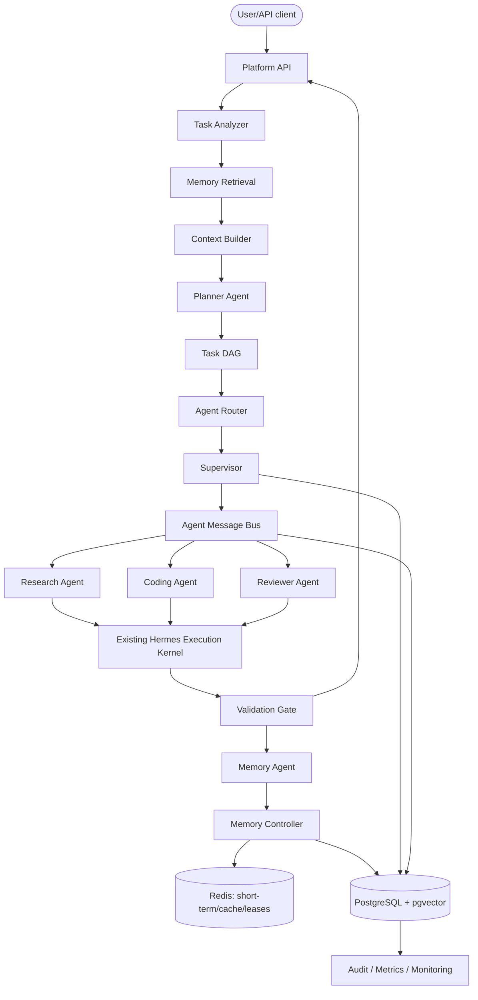

# Agent Orchestration Framework — архитектурный проект

**Статус:** предложение для согласования, реализация не начата  
**Целевой репозиторий:** `/home/hermes/.hermes/hermes-agent-sprint137`  
**Назначение:** production-фундамент автономной AI Agent Platform поверх существующего Hermes V2 runtime.

## 1. Результат анализа репозитория

В репозитории уже существует значительная часть безопасного execution kernel. Новый framework нельзя строить параллельным монолитом или заменять им проверенные компоненты.

| Существующий модуль | Что уже реализовано | Решение по интеграции |
|---|---|---|
| `agent/runtime/` | `AgentRun`, `TaskContext`, строгая state machine, единый `RuntimeEvent` | Переиспользовать как lifecycle одного execution attempt |
| `agent/orchestrator/` | bounded loop, budgets, plan validation, retry policy, resume/approve/cancel/inspect | Использовать как низкоуровневый execution kernel; не дублировать |
| `agent/execution/` | deterministic planner из explicit step specs, tool registry/runtime, approval, verifier | Planner Agent компилирует план в этот контракт |
| `agent/persistence/` | SQLite store для runs/plans/steps/approvals/events | Оставить для локального/legacy режима; добавить PostgreSQL repositories для platform control plane |
| `agent/recovery/` | crash classification, safe resume, manual review | Supervisor использует как authority по восстановлению attempt |
| `agent/intent_router/` | deterministic task/intent classification | Использовать как один из сигналов Task Analyzer, не как полный AI planner |
| `agent/capability_router/` | capability registry, policy decision, health/rollout gates | Использовать для сопоставления agent capability с разрешённым tool surface |
| `agent/verified_tool_executor/` | receipts, idempotency, timeout, UNKNOWN outcome, side-effect validation | Единственный production execution boundary для инструментов |
| `agent/system_boundary/` | resource/operation/effective-action classification, preflight, blast radius | Обязательный policy gate перед mutation-capable действиями |
| `agent/sandbox_runtime/` | sandbox mutation pipeline, snapshot, rollback, locks, recovery | Использовать только после отдельного hardening gate; не давать Coding Agent прямой shell bypass |
| `gateway/platforms/api_server.py`, `gateway/authz_mixin.py` | защищённый aiohttp API: bearer auth, profile scoping, body/CORS/concurrency guards | Переиспользовать auth/profile/security semantics через adapter; не дублировать небезопасно |
| `agent/memory_manager.py` и `agent/memory_provider.py` | provider lifecycle, prefetch/sync hooks, context fencing, prompt-injection sanitation | Добавить adapter нового Memory Intelligence как выбранный provider |
| `tools/memory_tool.py` | bounded curated `MEMORY.md`/`USER.md`, atomic writes, injection scan | Сохранить как human-curated profile memory; не использовать как platform semantic store |
| `agent/context_engine.py` | context selection/compression и bounded memory egress | Context Builder интегрировать через существующий sanitized memory-context seam |
| `hermes_cli/web_server.py`, `hermes_cli/web_routers/` | FastAPI/dashboard routing | MVP API держать отдельным service; dashboard mount — позже за feature flag |
| `hermes_cli/observability/`, runtime event journals | shared metrics и audit events | Добавить bounded-label metrics adapter, не создавать второй несовместимый telemetry stack |

### Главные пробелы

1. Нет `BaseAgent` и реестра специализированных агентов с trust/quality statistics.
2. Нет task-level DAG, который координирует несколько agent runs.
3. Нет Agent Router и Supervisor с lease/heartbeat/alternative-agent escalation.
4. Нет durable AgentMessage bus с outbox/inbox и deduplication.
5. Нет native Redis short-term memory, PostgreSQL long-term/working memory и канонического pgvector repository. Memory plugins (включая Mem0/векторные backends) являются provider-specific и не образуют platform authority.
6. Нет Memory Controller с remember/forget/consolidate policy и learning loop.
7. Нет отдельного REST API для agents/tasks/memory.
8. Нет production compose для orchestrator/API/PostgreSQL/pgvector/Redis/monitoring.

### Compatibility constraints из текущей memory подсистемы

- `MemoryManager` сознательно активирует не более одного external memory provider, поэтому Agent Platform provider должен быть выбран явно и не может незаметно работать параллельно с Mem0/Hindsight/Supermemory.
- Existing session/message storage и FTS работают на SQLite и полезны как patterns/adapters, но не являются PostgreSQL production schema.
- Provider payload может содержать tool output, paths и workspace data; egress/redaction policy обязательна до embedding или внешней синхронизации.
- Existing provider-specific vector migrations не должны использоваться как platform migrations: смена embedding dimension обязана быть versioned и non-destructive.
- `ContextEngine.select_context()` следует задействовать только если framework заменяет transcript selection; обычная Top-K recall injection должна идти через `MemoryProvider.prefetch()`.

## 2. Domain model и границы

### Канонические термины

- **Task** — пользовательская цель уровня control plane. Может иметь несколько execution attempts и агентов.
- **TaskStep** — узел DAG с dependency edges, требуемыми capabilities и validation contract.
- **AgentDefinition** — зарегистрированное описание агента; не активный процесс и не Python import path из API.
- **AgentRun** — одна попытка одного агента выполнить один TaskStep. Сопоставляется с существующим `agent.runtime.AgentRun`.
- **AgentMessage** — versioned envelope внутренней коммуникации. Не является authority на выполнение.
- **MemoryItem** — нормализованное знание с provenance, scope, value score и lifecycle.
- **WorkingMemoryItem** — промежуточное task-scoped состояние; не считается долгосрочным знанием.
- **Experience** — оценённый результат AgentRun, из которого Memory Agent может извлечь lesson.
- **HumanReview** — terminal escalation для ambiguous side effects, исчерпанных retry/alternative routes или policy denial.

### Bounded contexts

1. **Agent Runtime** — интерфейс агента, registry, permissions, health, quality stats.
2. **Orchestration Control Plane** — Task lifecycle, DAG, routing, supervision, message flow.
3. **Execution Kernel** — существующие runtime/orchestrator/execution/security modules.
4. **Memory Intelligence** — scoring, retention, retrieval, consolidation, context building.
5. **Platform Persistence** — PostgreSQL repositories, migrations, transactional outbox.
6. **Platform API** — authenticated REST surface.
7. **Observability & Audit** — events, metrics, traces, redacted append-only audit.

## 3. Целевая архитектура



### Главный принцип

Control plane решает **кто, когда и почему** выполняет работу. Existing execution kernel решает **можно ли и как безопасно выполнить tool action**. AgentMessage, AgentDefinition или trust score никогда не дают execution authority.

## 4. Agent Runtime

Предлагаемый contract:

```python
class BaseAgent(ABC):
    id: str
    role: str
    capabilities: tuple[str, ...]
    trust_score: float
    permissions: AgentPermissions

    async def analyze(self, task: AgentTask) -> AgentAnalysis: ...
    async def execute(self, context: AgentExecutionContext) -> AgentResult: ...
    async def validate(self, result: AgentResult) -> ValidationResult: ...
```

`AgentExecutionContext` должен быть immutable и содержать только:

- task/step/run IDs;
- bounded input/context;
- retrieved memory references и sanitized snippets;
- deadline/cancellation token;
- permission grant reference;
- idempotency key;
- approved tool/capability surface.

Он не содержит credentials, raw system prompt или прямые executors.

### Agent metadata

- уникальный `id`;
- `name`, `role`, version;
- capabilities;
- trust score `[0,1]`;
- permissions;
- availability/health;
- execution history через `agent_runs`;
- quality aggregates: success rate, validation score, latency, retry rate.

Trust score — routing signal, а не permission. Permissions вычисляются как пересечение:

```text
requested task permissions
∩ agent granted permissions
∩ tenant/platform policy
∩ tool/capability policy
```

### MVP system agents

- **PlannerAgent** — создает Task DAG и компилирует узлы в explicit step specs существующего `ExecutionPlanner`.
- **ResearchAgent** — read-only network/documentation capabilities; не пишет файлы.
- **CodingAgent** — file/code changes только через verified executor + sandbox runtime.
- **ReviewerAgent** — отдельный read-only validation run; не может утверждать собственный результат CodingAgent без независимого evidence.
- **MemoryAgent** — предлагает memory mutations; `MemoryController` детерминированно применяет policy и остается authority записи.

## 5. Orchestration Engine

### Task lifecycle

Публичная state machine:

```text
CREATED → PLANNING → EXECUTION → VALIDATION → COMPLETED
    │          │           │            │
    └──────────┴───────────┴────────────┴──→ FAILED
```

Дополнительные internal substates (`WAITING_AGENT`, `WAITING_APPROVAL`, `RETRY_SCHEDULED`, `HUMAN_REVIEW`) отражаются через reason code, но не размывают обязательный API contract.

`Task` и существующий `AgentRun` не дублируют друг друга:

- Task — долгоживущая бизнес-цель;
- AgentRun — отдельная попытка выполнения TaskStep;
- один Task может иметь несколько AgentRuns из-за parallel work, retry или alternative agent.

### План

Planner возвращает versioned DAG:

- nodes: step ID, goal, expected output schema, required capabilities, permissions, timeout, retry class;
- edges: dependencies;
- validation criteria;
- memory retrieval query;
- idempotency key;
- compensation/recovery disposition для side-effectful nodes.

План сначала проверяют shape validator, cycle detector, capability policy и permission policy. Только после этого он становится `ACTIVE`.

### Agent Router

Router выбирает только из healthy allowlisted agent definitions. Рекомендуемый deterministic score:

```text
route_score =
  capability_match * 0.35 +
  trust_score       * 0.20 +
  quality_score     * 0.20 +
  availability      * 0.15 +
  cost_fit          * 0.10
```

Hard gates выполняются до scoring: permissions, health, tenant access, required capabilities, concurrency budget.

### Supervisor

Supervisor использует Redis leases/heartbeats и PostgreSQL state:

```text
failure/timeout
→ classify outcome
→ safe retry только для idempotent/non-ambiguous action
→ alternative compatible agent
→ escalation event
→ Human Review
```

Нельзя автоматически retry-ить `UNKNOWN_OUTCOME` или mutation, для которой уже мог произойти side effect. Решение берет evidence из existing recovery/receipt layer.

## 6. Agent Communication Layer

Базовый envelope расширяется production-полями:

```text
AgentMessage
- id
- schema_version
- from_agent
- to_agent
- task_id
- step_id
- run_id
- type: request|response|event|feedback|error
- priority
- payload
- timestamp
- correlation_id
- causation_id
- idempotency_key
- attempt
- expires_at
```

### Transport

- Redis Streams + consumer groups для delivery.
- PostgreSQL transactional outbox для атомарности task-state/message publication.
- Inbox deduplication по `(consumer_id, message_id)`.
- At-least-once transport, exactly-once **effective processing** через idempotency/receipts.
- Redis Pub/Sub не использовать как authoritative bus: сообщения могут теряться.
- Payload проходит schema validation, size limit, redaction и tenant-scope check.

## 7. Memory Intelligence

### Уровни

| Уровень | Scope | Storage | Lifecycle |
|---|---|---|---|
| Short Term | conversation/session | Redis | TTL 24 часа |
| Working | task/step/agent run | PostgreSQL canonical + Redis hot cache | до terminal task + retention window |
| Long Term | tenant/user/agent | PostgreSQL | постоянная, versioned, forget policy |
| Semantic | searchable projection Long Term/Experience | pgvector | синхронно с memory record/version |

Short Term Memory не равна полной истории сообщений: хранится bounded context window, active decisions и task pointers.

### MemoryItem

Обязательные поля пользователя дополняются:

```text
id, tenant_id, user_id, agent_id, task_id
content, type
importance_score, confidence
created_at, updated_at, last_used, usage_count, expiration
provenance_type, provenance_ref
sensitivity, status, version
embedding, embedding_model, embedding_dimension
content_hash
```

### Scoring

Канонический value score:

```text
score = importance * confidence * recency * usage_frequency
```

Все множители нормализованы в `[0,1]`:

```text
recency = exp(-ln(2) * age_seconds / half_life_seconds)
usage_frequency = 0.25 + 0.75 * min(1, log1p(usage_count) / log1p(20))
```

Floor `0.25` не дает новой записи с `usage_count=0` навсегда исчезнуть из retrieval.

Hybrid retrieval rank:

```text
rank = 0.60 * semantic_similarity
     + 0.25 * memory_score
     + 0.15 * scope_match
```

Перед ranking применяются hard filters: tenant/user scope, status, expiry, sensitivity, permission, memory type.

### Remember policy

Сохранять:

- устойчивые предпочтения пользователя;
- архитектурные решения и обоснование;
- доказанно успешные стратегии;
- повторяемые failure lessons;
- проверенные факты с provenance.

Не сохранять:

- погоду/новости «сегодня» без отдельного time-series use case;
- secrets, credentials, auth payloads;
- raw tool output и stack traces;
- неподтвержденные гипотезы как facts;
- дубликаты или transient conversation filler.

Memory Agent предлагает `MemoryProposal`; только Memory Controller применяет deterministic policy и пишет запись.

### Forget

- expiry sweep для transient записей;
- decay + low usage + low importance;
- explicit user deletion;
- superseded/contradicted records;
- soft-delete/tombstone с audit trail;
- удаление vector projection в той же транзакции, чтобы забытая запись не «воскресла» через semantic search.

### Consolidate

Похожие записи группируются по scope/type и similarity. Consolidated item получает lineage links к source items. Sources становятся `SUPERSEDED`, а не физически исчезают без аудита. LLM summary проходит schema validation и не может повысить confidence выше максимума подтвержденных источников без нового evidence.

### Context Retrieval Engine

1. Нормализовать task query.
2. Отфильтровать scope/permissions/expiry.
3. Выполнить lexical + vector retrieval.
4. Применить memory score и diversity/MMR.
5. Выбрать Top-K в token budget.
6. Sanitize/redact и обрамить как untrusted memory context.
7. Передать references отдельно от rendered snippets.
8. Обновить `last_used`/`usage_count` асинхронно и идемпотентно.

Никогда не загружать всю память в prompt.

## 8. Learning Loop

```text
AgentResult
→ independent Evaluation
→ Experience record
→ lesson extraction proposal
→ Memory Controller policy
→ store/consolidate/reject
→ future retrieval metrics
```

Quality update выполняется только после validation evidence. Self-reported success агента не повышает trust самостоятельно. Trust/quality обновления versioned и audit-logged.

## 9. Security

### Permission model

```text
read_files
write_files
execute_code
network_access
memory_read
memory_write
agent_message_send
```

- Default deny.
- Agent registration API не принимает произвольный Python import path или executable command.
- Implementation IDs должны соответствовать allowlisted code/plugin registry.
- Network destinations и file roots ограничиваются policy.
- Coding execution идет через sandbox + verified tool executor.
- Memory retrieval obeys tenant/user/sensitivity ACL.
- Secrets не попадают в task context, messages, memory, logs или embeddings.
- Prompt/memory content считается untrusted data и не может менять permissions.
- Audit log append-only; административные memory delete и agent registration записываются.

### Isolation

MVP isolation — отдельный worker context, immutable execution context, bounded tool registry, deadlines и cancellation. Для повышенного риска — process/container sandbox profile. Один in-process Python object не является security boundary.

### Обязательный pre-implementation security gate

Read-only аудит текущей композиции обнаружил, что `sandbox_runtime` пока нельзя автоматически считать production authority:

- boundary может быть сконфигурирована как `None`;
- pipeline имеет прямой путь к adapter execution вместо обязательного `VerifiedToolExecutor` composition root;
- строковые verdict-ы не должны заменять typed, runtime-owned capability decision;
- automatic approval внутри mutation pipeline недопустим для production Coding Agent;
- production source composition `VerifiedToolExecutor` должна быть явной и тестируемой, а не существовать только в test fixtures.

До включения `CodingAgent.write_files/execute_code` необходимо: сделать boundary обязательной, связать Capability Router → Policy → System Boundary → Verified Tool Executor → Sandbox Adapter в одном composition root, запретить caller-supplied verdict/approval и добавить adversarial bypass tests. До прохождения gate Coding Agent работает только в read-only/shadow режиме.

## 10. Persistence model

Требуемые таблицы:

- `agents` — definition metadata, trust, permissions, health/version.
- `tasks` — public task lifecycle, context digest, owner/tenant, version.
- `agent_runs` — attempt, agent/task/step, result, duration, success, runtime run reference.
- `memories` — content/metadata/vector/lifecycle.

Необходимые дополнительные таблицы:

- `task_steps`, `task_dependencies`;
- `agent_messages`, `message_inbox`, `message_outbox`;
- `working_memory_items`, `memory_links`, `memory_usage_events`;
- `task_events`, `audit_events`;
- `agent_quality_snapshots`, `human_reviews`;
- `schema_migrations`.

Все mutable rows имеют `version` для optimistic concurrency. Foreign keys используют `RESTRICT` для audit-critical records. Outbox publishing и state transition происходят в одной PostgreSQL transaction.

## 11. REST API

Обязательная поверхность:

```text
GET    /agents
POST   /agents/register
POST   /tasks
GET    /tasks/{id}
POST   /memory/search
POST   /memory/store
DELETE /memory/{id}
```

Production-дополнения:

```text
GET    /tasks/{id}/events
POST   /tasks/{id}/cancel
POST   /tasks/{id}/human-review
GET    /healthz
GET    /readyz
GET    /metrics
```

Правила:

- `POST /tasks` возвращает `202 Accepted` и task ID.
- Mutation endpoints требуют `Idempotency-Key`.
- Pydantic request/response schemas; payload limits.
- Auth обязателен; scopes разделяют agent admin, task submit/read и memory read/write/delete.
- Tenant/user scope берется из authenticated principal, не из доверенного request body.
- Error responses имеют canonical code/correlation ID и не раскрывают exception/secret.

## 12. Observability

### Метрики

- `agent_runs_total{role,outcome}`;
- `agent_run_duration_seconds{role}`;
- `agent_success_rate` как derived dashboard metric;
- `tasks_total{status}`;
- `task_retries_total{reason}`;
- `memory_search_total{hit}`;
- `memory_search_duration_seconds`;
- `memory_context_items_count`;
- `supervisor_escalations_total{reason}`;
- queue lag и outbox backlog.

Task/agent IDs не использовать как metric labels из-за cardinality; они остаются в logs/traces.

### Structured JSON log

```json
{
  "timestamp": "...",
  "level": "INFO",
  "agent": "research-v1",
  "task": "...",
  "run": "...",
  "event": "agent_run_completed",
  "result": "success",
  "correlation_id": "..."
}
```

Логи проходят redaction. Audit events содержат digests/references вместо raw secrets и больших payloads.

## 13. Предлагаемая структура каталогов

```text
agent/
  agent_runtime/
    base.py
    models.py
    permissions.py
    registry.py
    quality.py
    exceptions.py

  agent_orchestration/
    engine.py
    analyzer.py
    planner.py
    router.py
    supervisor.py
    task_graph.py
    messages.py
    message_bus.py
    policies.py
    events.py
    exceptions.py

  system_agents/
    planner.py
    research.py
    coding.py
    reviewer.py
    memory.py

  memory_intelligence/
    models.py
    controller.py
    scoring.py
    retrieval.py
    context_builder.py
    consolidation.py
    retention.py
    policies.py
    ports.py
    provider_adapter.py
    exceptions.py

  platform_persistence/
    unit_of_work.py
    repositories.py
    postgres.py
    redis.py
    outbox.py
    migrations/
      0001_agent_platform.sql
      0002_memory_pgvector.sql

  platform_api/
    app.py
    dependencies.py
    auth.py
    errors.py
    schemas/
      agents.py
      tasks.py
      memory.py
    routers/
      agents.py
      tasks.py
      memory.py
      health.py

  platform_observability/
    logging.py
    metrics.py
    audit.py
    tracing.py

tests/
  agent_runtime/
  agent_orchestration/
  system_agents/
  memory_intelligence/
  platform_persistence/
  platform_api/
  integration/agent_platform/
  load/agent_platform/

deploy/agent-platform/
  docker-compose.yml
  Dockerfile
  prometheus.yml
  env.example

docs/hermes-v2/
  agent-orchestration-framework-architecture.md
  agent-orchestration-framework-runbook.md
```

## 14. Точки интеграции

1. `agent/agent_orchestration/engine.py` вызывает existing `RuntimeOrchestrator` через adapter, не импортирует tool handlers напрямую.
2. `PlannerAgent` формирует canonical DAG; execution adapter переводит node в existing `TaskContext` + explicit `step_specs`.
3. `Agent Router` использует `agent/capability_router` и отдельный AgentRegistry; два router имеют разные domains.
4. `CodingAgent` получает только sandbox-bound tools через `verified_tool_executor` и `sandbox_runtime`.
5. `Supervisor` использует existing recovery dispositions и receipts; UNKNOWN всегда идет в human review.
6. `Memory Intelligence` реализует `MemoryProvider` adapter для существующего `MemoryManager.prefetch/sync` seam.
7. Existing curated `MEMORY.md`/`USER.md` импортируются только как отдельный human-curated source; автоматическая двусторонняя синхронизация по умолчанию запрещена.
8. API запускается отдельным FastAPI app/service. Mount в dashboard — отдельный rollout этап.
9. Platform metrics экспортируются через adapter к существующему shared metrics runtime и Prometheus endpoint.
10. Production activation выполняется feature flags и canary; новый framework по умолчанию выключен.

## 15. Deployment

Отдельный Compose stack:

- `orchestrator` — task dispatcher/supervisor/workers;
- `api` — FastAPI без выполнения tool actions внутри web process;
- `postgres` — `pgvector/pgvector` image, private network, persistent volume;
- `redis` — AOF, private network, auth/TLS в production profile;
- `monitoring` — Prometheus scraping API/orchestrator;
- one-shot `migrate` job до readiness.

Database/Redis порты не публикуются наружу. Secrets передаются через secrets files/manager, не committed `.env`. Healthchecks разделяют liveness/readiness. Rolling restart не должен терять queued tasks: authoritative state — PostgreSQL/outbox, Redis — transport/cache/lease.

## 16. Testing и acceptance gates

### Unit

- BaseAgent lifecycle и validation contract;
- registry uniqueness/version/permissions;
- Task DAG cycle/dependency checks;
- Agent Router hard gates и deterministic ranking;
- Memory scoring, expiry, remember/forget/consolidate;
- hybrid Top-K retrieval и token budget;
- Supervisor retry/alternative/escalation rules.

### Integration

- Planner → router → two specialized agents → reviewer → memory update;
- memory retrieval injection с ACL и sanitization;
- worker crash после STARTED, restart и safe recovery;
- outbox crash window без lost/duplicate effective message;
- UNKNOWN mutation → human review, zero retry;
- PostgreSQL/Redis/pgvector migrations and repositories;
- API auth, idempotency и tenant isolation.

### Load

100 concurrent tasks:

- все задачи получают terminal или explicit human-review state;
- потерянных tasks/messages = 0;
- duplicate effective side effects = 0;
- deadlocks = 0;
- API enqueue p95 < 250 ms на reference host;
- memory search p95 < 300 ms для согласованного corpus size;
- queue lag и resource usage зафиксированы.

### Security gates

- agent permissions default deny;
- sandbox escape tests;
- cross-tenant memory/task access denied;
- prompt-injected memory не меняет policy;
- arbitrary agent implementation registration denied;
- secrets absent from logs, messages, memories и embeddings;
- audit event exists for every mutation/registration/deletion.

## 17. Поэтапная реализация после подтверждения

1. Domain contracts и TDD state machines.
2. Agent Runtime + registry/permissions/quality.
3. Task DAG + AgentMessage + in-memory adapters.
4. PostgreSQL/Redis/pgvector persistence, migrations, outbox.
5. Memory Intelligence и Context Builder.
6. MVP system agents и execution-kernel adapters.
7. Supervisor/recovery/human review.
8. REST API/auth/idempotency.
9. Metrics/logging/audit.
10. Compose/integration/load/security tests.
11. Shadow/canary rollout; production activation только отдельным операторским решением.

## 18. Решения, требующие подтверждения

1. Framework создается в текущем Hermes V2 sprint workspace, а не отдельном repository.
2. PostgreSQL становится control-plane authority; existing SQLite остается local/legacy adapter.
3. Redis Streams выбран вместо Celery/RQ/Kafka для MVP.
4. Мультитенантные `tenant_id/user_id` вводятся с первой миграции.
5. API — отдельный service, не прямое изменение существующего dashboard/gateway.
6. Existing `MemoryManager` остается host integration point; новая память подключается provider adapter-ом.
7. Реализация начинается только после явного подтверждения этого документа.
